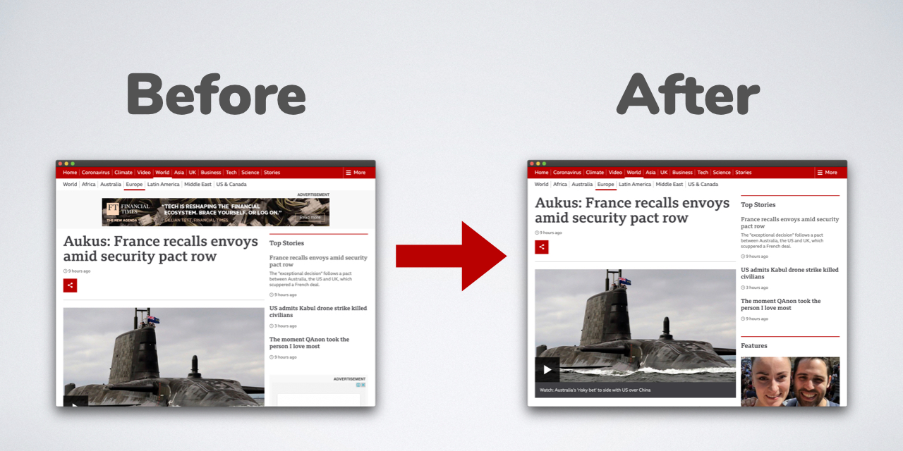

# A Minimal QtWebEngine Web Browser with Adblocker

## How Does It Work 

This is a minimal `network filter` implementation using `QWebEngineUrlRequestInterceptor` and `QtWebEngine`, with AdBlock Plus compatible filters provided by [easylist](https://easylist.to/easylist/easylist.txt). The parser is currently based on `ad-block` from Brave, but alternatives might be needed in the future. 

Reference:
- https://adblockplus.org/blog/investigating-filter-matching-algorithms
- https://brave.com/improved-ad-blocker-performance/

### Dependencies

- Qt 5.10+ with `QtWebEngine` module 

    On Debian or Ubuntu, this can be done by: 

        sudo apt install qtwebengine5-dev qml-module-qtwebengine \ 
        qml-module-qtquick-window2 qml-module-qtquick2 qml-module-qtquick-controls2

- ABP-style parser from Brave's [ad-block](https://github.com/brave/ad-block) C++ library 

    Checkout this repo: 
    
        git clone https://github.com/penk/minimal-webbrowser-adblock
        cd minimal-webbrowser-adblock
        mkdir -p third_party

    Then checkout the following 3 repositories: 

        git clone https://github.com/brave/ad-block.git third_party/ad-block 
        git clone https://github.com/brave/hashset-cpp.git third_party/hashset-cpp 
        git clone https://github.com/brave/bloom-filter-cpp.git third_party/bloom-filter-cpp 

    And copy all `*.h` and `*.cc` to `third_party/ad-block`:

        cp third_party/hashset-cpp/{*.cc,*.h} third_party/ad-block/
        cp third_party/bloom-filter-cpp/{*.cpp,*.h} third_party/ad-block/

### Build Instructions 

    qmake DEFINES+=USE_ADBLOCK
    make 

## Copyright & License 

Copyright © 2021 Penk Chen &lt;<penkia@gmail.com>&gt;

- This project is licensed under GPL 3+, see the file LICENSE for details. 

- The Brave dependencies are licensed under MPL, which is unmodified and not included or redistribued in this project. It should be handled according to the [Initial Distribution of MPL-licensed Files As Part Of an (L)GPL-licensed Project](https://www.mozilla.org/en-US/MPL/2.0/combining-mpl-and-gpl/) guidelines. 
